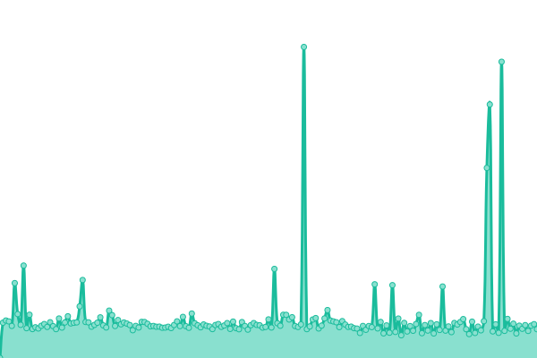

# [📈 Live Status](https://stats.pethor.eu): <!--live status--> **🟩 All systems operational**

This repository contains the open-source uptime monitor and status page for [Upptime](https://upptime.js.org), powered by [Upptime](https://github.com/upptime/upptime).

With [Upptime](https://upptime.js.org), you can get your own unlimited and free uptime monitor and status page, powered entirely by a GitHub repository. We use [Issues](https://github.com/upptime/upptime/issues) as incident reports, [Actions](https://github.com/upptime/upptime/actions) as uptime monitors, and [Pages](https://stats.pethor.eu) for the status page.

<!--start: status pages-->
<!-- This summary is generated by Upptime (https://github.com/upptime/upptime) -->
<!-- Do not edit this manually, your changes will be overwritten -->
<!-- prettier-ignore -->
| URL | Status | History | Response Time | Uptime |
| --- | ------ | ------- | ------------- | ------ |
|  Plex | 🟩 Up | [plex.yml](https://github.com/wtfpeter/stats/commits/HEAD/history/plex.yml) | 

 606ms
     
 | 

<a href="https://stats.pethor.eu/history/plex">100.00%</a>
    

|  [Overseer](https://req.pethor.eu/) | 🟩 Up | [overseer.yml](https://github.com/wtfpeter/stats/commits/HEAD/history/overseer.yml) | 

 1335ms
     
 | 

<a href="https://stats.pethor.eu/history/overseer">100.00%</a>
    

|  [Monitoring](https://mon.pethor.eu/) | 🟩 Up | [monitoring.yml](https://github.com/wtfpeter/stats/commits/HEAD/history/monitoring.yml) | 

 1649ms
     
 | 

<a href="https://stats.pethor.eu/history/monitoring">99.01%</a>
    

|  [Cloud](https://cloud.pethor.eu) | 🟩 Up | [cloud.yml](https://github.com/wtfpeter/stats/commits/HEAD/history/cloud.yml) | 

 1091ms
     
 | 

<a href="https://stats.pethor.eu/history/cloud">99.85%</a>
    

<!--end: status pages-->

[**Visit our status website →**](https://stats.pethor.eu)

## 📄 License

- Code: [MIT](./LICENSE) © [Upptime](https://upptime.js.org)
- Data in the `./history` directory: [Open Database License](https://opendatacommons.org/licenses/odbl/1-0/)
